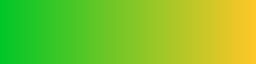
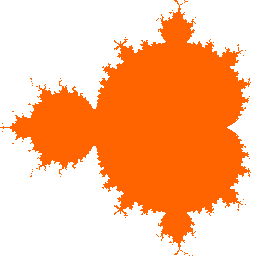

CreateImg
===

# Overview
This Google Apps Script (GAS) library creates an image file from coordinate data.

# Description
Although I had been looking for such libraries or methods for GAS, unfortunately I have never found them. So I made this.

In the library, at first, binary bitmap data with 8 bit colors is created. And then, a file is converted it to the selected image format.

# Script ID
This is an ID to use this library.

```
12ORcMxw4A0cs4yo7Nir5myfxf2tQu90X68EGF-aUMczzrE7Np7ZOr0Mw
```

# Requirement

- Google account

# Usage
## How to install this library

- Open Script Editor. And please operate follows by click.
- -> Resource
- -> Library
- -> Input Script ID to text box
- -> Add library
- -> Please select latest version
- -> Developer mode ON (If you don't want to use latest version, please select others.)
- -> Identifier is "**``CreateImg``**".

[If you want to read about Libraries, please check this.](https://developers.google.com/apps-script/guide_libraries).

## How to use this library

```
CreateImg.Do(int[] data, int[][] colors, int wsize, int hsize, string filename, string ext)
```

- ``data`` : Coordinates of color index. Color index is corresponding to the index of color code array.
- ``colors`` : Color code [[r, g, b], [r, g, b],,,]. Each parameter is 0 - 255.
- ``wsize`` : Image width.
- ``hsize`` : Image height.
- ``filename`` : Output filename on Google Drive.
- ``ext`` : Extension of output image format. **You can choose from bmp, gif, jpg and png.**

You can choose output image format by ``ext``. Output file is created to the root folder on Google Drive.

File ID of the created image is returned.

### limitations

- Colors are 8 Bits. (256 colors)
- Coordinates for x axis and y axis have to be multiples of 4.

## Sample script
Each coordinate is the index of color pallets. This is the specification of 8 bits bitmap. Since the number of colors is 256 (8 Bits), All values which are used in the data are from 0 to 255.

### Script 1 : Gradation bar

~~~javascript
function test_main() {
  var wsize = 512;
  var hsize = 128;
  var data = [];
  for (var h = 0; h < hsize; h++) {
    for (var w = 0; w < wsize; w++) {
      data.push(255 * w / wsize);
    }
  }

  var colors = [];
  var numberofcolors = 256;
  for (var i = 0; i < numberofcolors; i++) {
    colors.push([i, 199, 39]);
  }

  var fileid = CreateImg.Do(data, colors, wsize, hsize, "sample1.png", "png");
  Logger.log(fileid)
}
~~~

**Result 1 :**



### Script 2 : Mandelbrot set

~~~javascript
function mandelbrot(size) {
  var r = {
    sh:   3.0,
    sw:   2.0,
    sa:   20,
    size: size
  };
  var results = [];
  for (var j = 0; j < r.size; j++) {
    for (var i = 0; i < r.size; i++) {
      var xx = 0.0;
      var yy = 0.0;
      var d = true;
      for (var k = 0; k < r.sa; k++) {
        var xx1 = (Math.pow(xx, 2) - Math.pow(yy, 2)) - r.sh / 2 + (2.0 / r.size * i);
        var yy1 = (2 * xx * yy) - r.sw / 2 + (2.0 / r.size * j);
        xx = xx1;
        yy = yy1;
        if (Math.pow(xx, 2)+Math.pow(yy, 2) > 4) {
          d = false;
          break;
        }
      }
      results.push(d ? 1 : 0);
    }
  }
  return results;
}

function test_main(){
  var colors = [[255, 255, 255], [255, 100, 0]]; // Outer color, Inner color
  var fileid = CreateImg.Do(mandelbrot(256), colors, 256, 256, "sample2.png", "png");
  Logger.log(fileid)
}
~~~

**Result 2 :**



# Licence

[MIT](LICENCE)

# Author

[TANAIKE](https://github.com/tanaikech)

